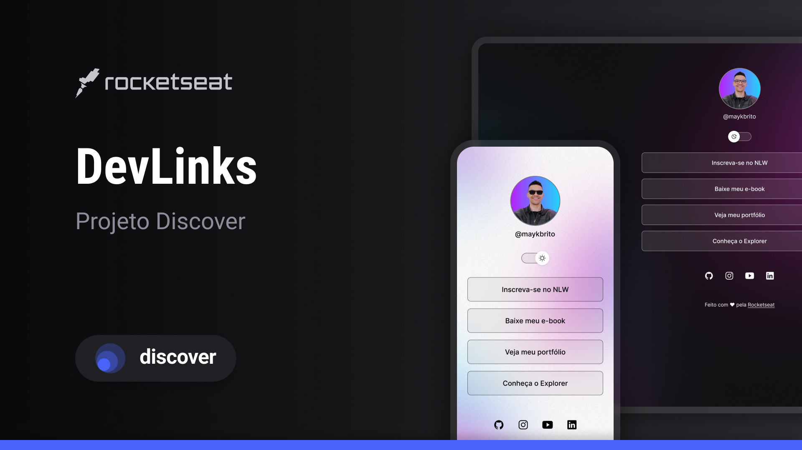

<h1 align="center">DevLinks</h1>

Programa exclusivo e gratuito, promovido pela Rocketseat para ensino de tecnologias WEB.

  <a href="#-tecnologias">Tecnologias</a>&nbsp;&nbsp;&nbsp;|&nbsp;&nbsp;&nbsp;
  <a href="#-projeto">Projeto</a>&nbsp;&nbsp;&nbsp;|&nbsp;&nbsp;&nbsp;
  <a href="#-layout">Layout</a>&nbsp;&nbsp;&nbsp;|&nbsp;&nbsp;&nbsp;
  <a href="#memo-licença">Licença</a>

  

 

## Tecnologias

Este projeto foi desenvolvido com as seguintes tecnologias:

_ HTML e CSS
_ Javascript
_ Git e Github
_ Figma

## Projeto

O DevLinks é um agregador de Links para usar como cartão de visitas online.

## Layout

Você pode visualizar o layout do projeto através [DESSE LINK]
(https://www.figma.com/file/AHGVUJFgmRYbNenge9vy5U/DevLinks-•-Projeto-Discover-(Community)?type=design&node-id=10-620&mode=design&t=ccHVzJUsPF6BWf1k-0). É necessário ter conta no [Figma](htpps://figma.com) para acessá-lo.

## :memo: Licença

Este projeto está sob a Licença MIT.
